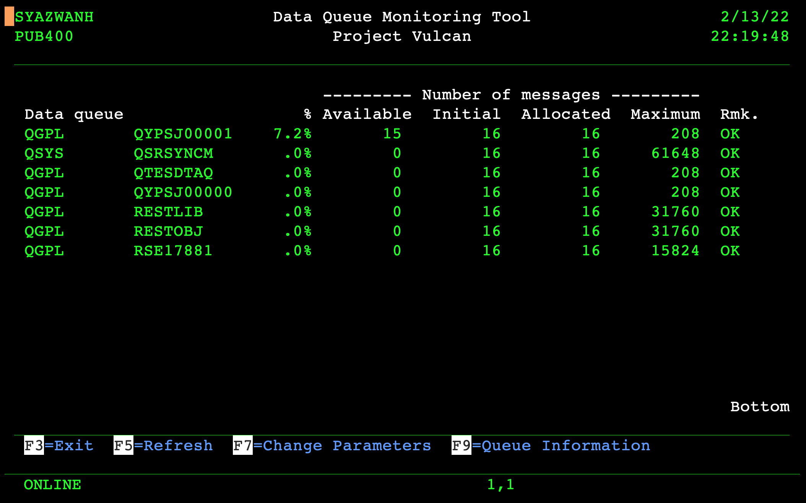
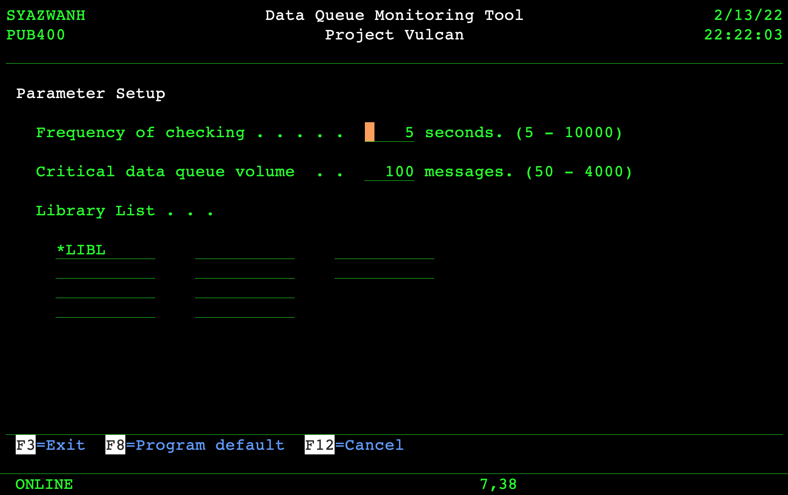
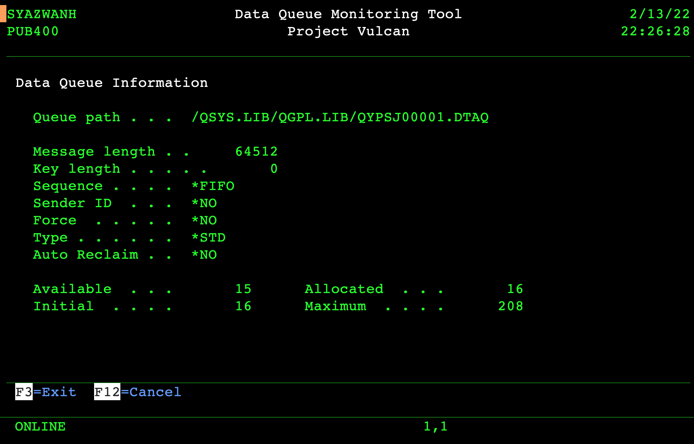

# AS400 Data Queue Monitor
Monitor data queues ('DTAQ') on 5250 green screen.

## Introduction
This utility was written so that I could monitor DTAQ size. If you work in an environment where the interprocess communication between jobs is via DTAQ, you'd probably had experience where a DTAQ size just keeps growing, probably because a job is on MSGW or wasn't started.

## How to Compile
First, upload the source to your AS/400 using FTP or other similar means, then set the correct source type for each member:
1. PVQDEPUS RPGLE
2. PVQDEPUSPF PF
3. PVQDEPUSD DSPF

Compile the PF first using option 14. Then DSPF using option 14. Then the RPGLE using option 15. Finally, issue CRTPGM PGM(PVQDEPUS). If you run into any difficulties with the source code, please verify that:
1. The source physical file ('PF') is at least 112 in length, for example, CRTSRCPF FILE(QRPGLESRC) RCDLEN(112).
2. The code page of the PF and your job is 37, for example, CHGJOB CCSID(37).
3. The FTP mode of transfer was set to ASCII during upload.

## Running the Program
Simply, CALL PVQDEPUS.

If there are data queues in your library list, it will show those data queues, sorted first by which one has the most pending entries. The screen will auto refresh itself every 5 seconds by default. Press F7 to change this default.

To get more data queue information, point your cursor to the data queue listed on screen and press F9.

